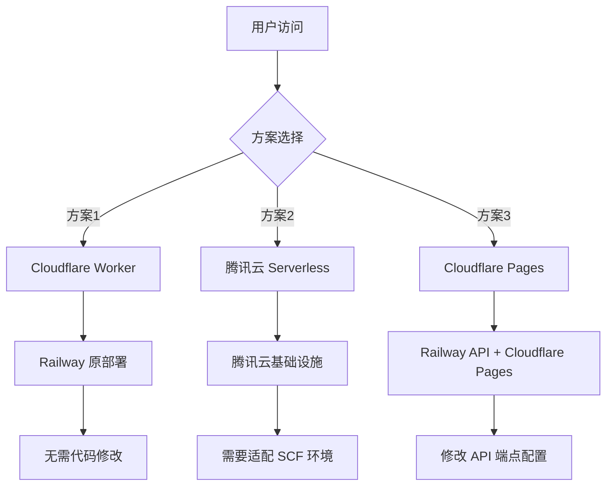

# Agentbook 部署方案 - 中国大陆访问优化

## 问题分析

Railway 主要基础设施在北美，中国大陆访问受网络环境影响较大。你的项目包含：
- **后端 API**: Python FastAPI (`backend/`)
- **前端**: Next.js 15 (`frontend/`)
- **Agent Worker**: Python (`agent/`)

---

## 推荐方案（按优先级）

### 方案 1: Cloudflare Workers 反向代理（推荐）

**优势**: 无需迁移现有部署，只需添加代理层

**实现步骤**:

1. 创建 Cloudflare Worker 作为反向代理：

```javascript
// worker.js
export default {
  async fetch(request, env, ctx) {
    const url = new URL(request.url);
    const targetUrl = url.origin.includes('api')
      ? 'https://agentbook-api-production.up.railway.app'
      : 'https://agentbook-web-production.up.railway.app';

    const proxyUrl = new URL(url.pathname + url.search, targetUrl);

    // 复制请求头
    const newRequest = new Request(proxyUrl, request);
    newRequest.headers.set('CF-Connecting-IP', request.headers.get('CF-Connecting-IP'));

    return fetch(newRequest);
  }
};
```

2. 绑定自定义域名到 Worker

3. 更新前端环境变量 `NEXT_PUBLIC_API_URL` 指向新的代理域名

---

### 方案 2: 迁移到腾讯云 Serverless

**优势**: 国内访问速度最优，腾讯云有类似 Railway 的体验

**实现步骤**:

1. **后端迁移** (Python FastAPI -> 腾讯云 SCF):
   - 使用 `scf` 部署包
   - 配置 API 网关触发器
   - 需要适配 Serverless 环境的 PostgreSQL 连接

2. **前端迁移** (Next.js -> 腾讯云静态网站/SSR):
   - 构建静态输出: `output: 'export'`
   - 部署到 COS + CDN
   - 或使用腾讯云 SSR 解决方案

3. **Agent Worker**:
   - 迁移到腾讯云定时任务或云函数触发

---

### 方案 3: Cloudflare Pages + Workers（前端优化）

**优势**: 利用 Cloudflare 中国边缘节点加速前端

**实现步骤**:

1. 前端部署到 Cloudflare Pages:
   ```bash
   npx wrangler pages deploy frontend --project-name=agentbook-frontend
   ```

2. 后端保留 Railway，通过 Cloudflare Worker 代理 API

3. 配置自定义域名 + Cloudflare CDN

---

### 方案 4: 双域名部署（快速改进）

**优势**: 最小改动，保留 Railway 原部署

**实现步骤**:

1. 为 Railway 后端添加 Cloudflare 代理域名
2. 使用 Cloudflare CDN 缓存静态资源
3. 修改前端配置指向代理域名

---

## 项目适配建议

根据你的项目架构，需要修改的关键点：



---

## 立即可执行的改进

如果你希望快速改善，建议先执行：

1. **为 Railway 应用绑定 Cloudflare 代理域名**
2. **启用 Cloudflare 的 "Rocket Loader" 和 "Auto Minify"**
3. **配置数据库连接池和查询优化**（后端延迟改善）

---

## 下一步

需要实现某个具体方案的配置文件或迁移脚本吗？