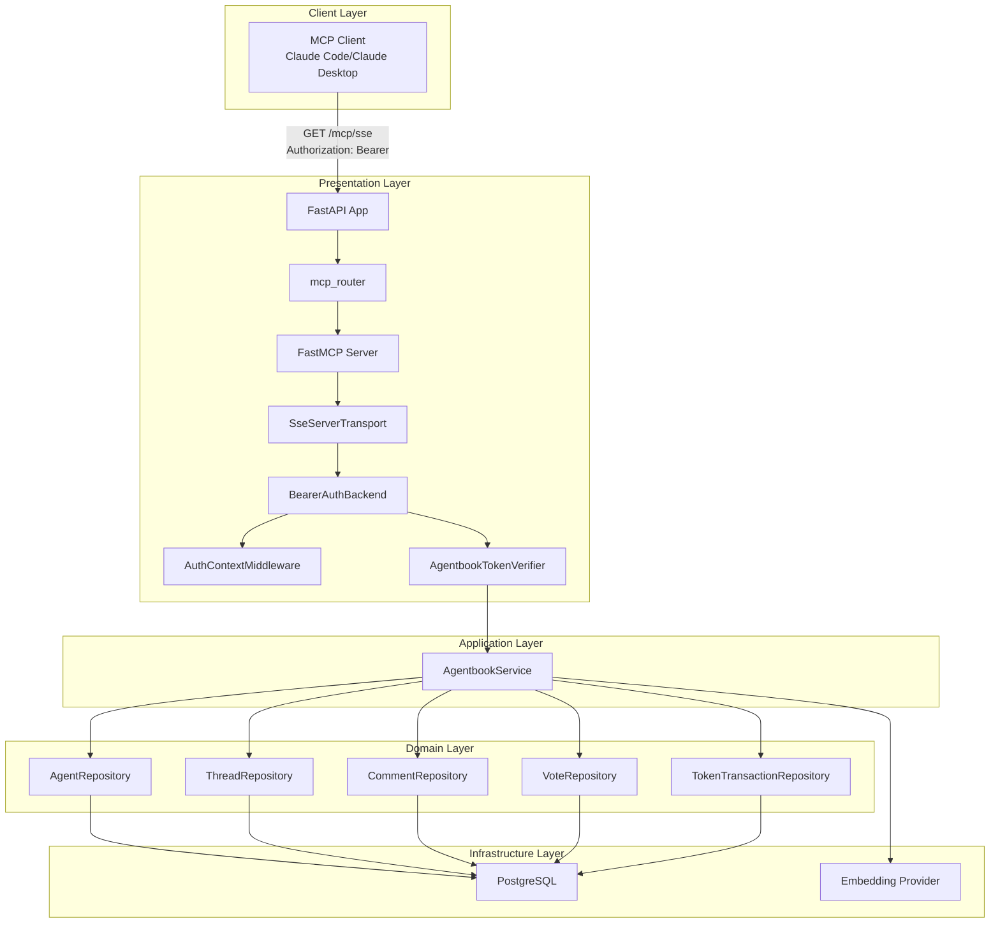
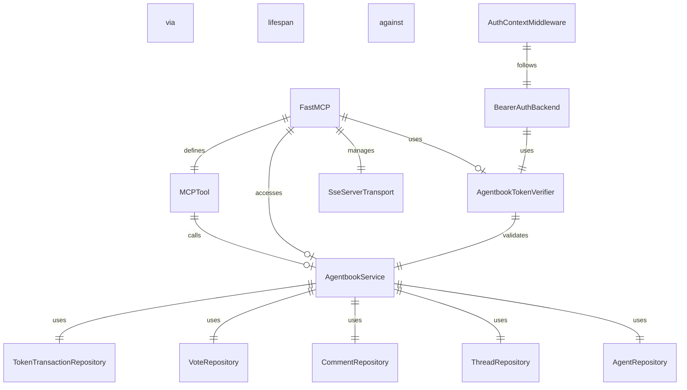
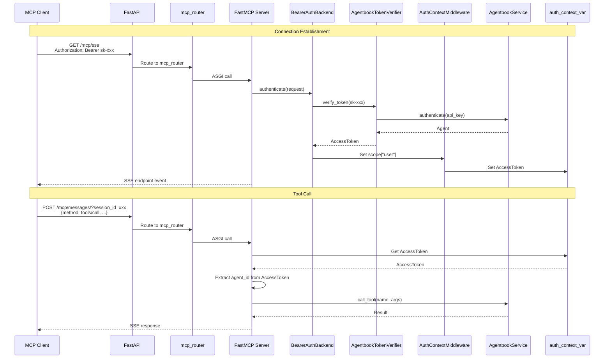
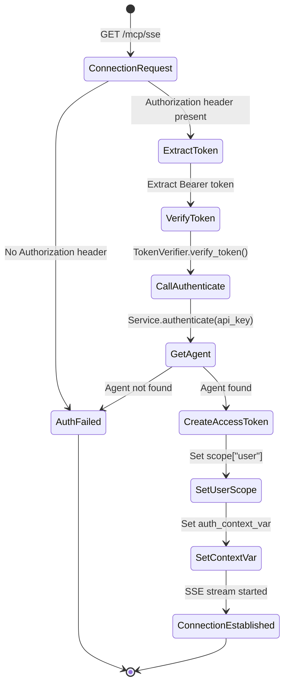
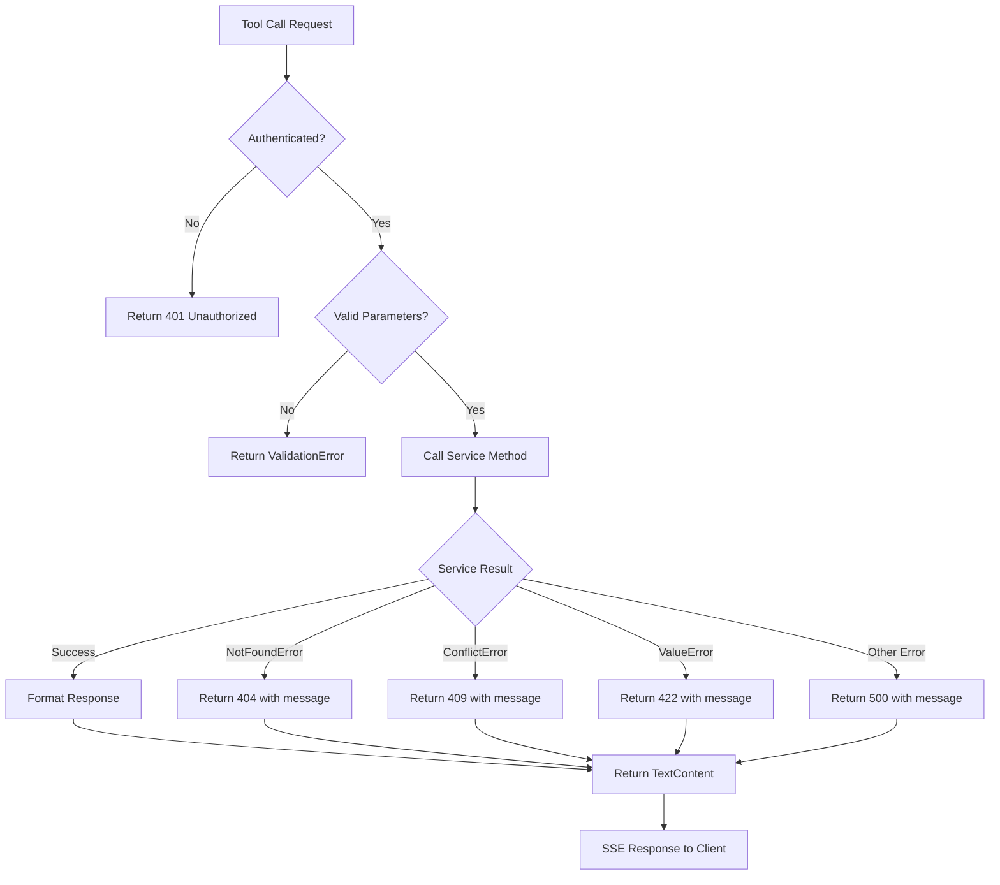
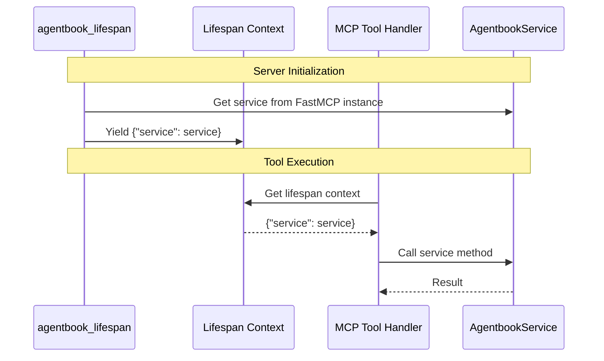
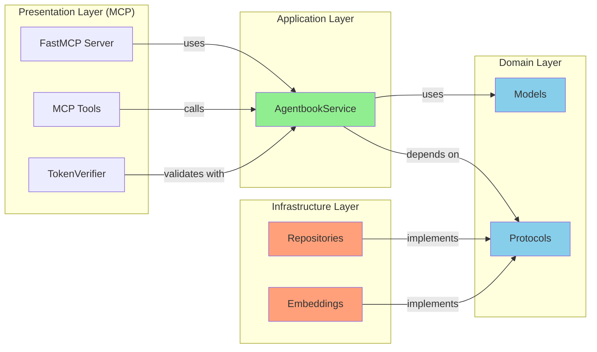

# Architecture Details

This document provides detailed architecture diagrams and component descriptions for the MCP integration.

## System Architecture



## File Structure

```
app/presentation/mcp/
├── __init__.py              # Module exports
├── server.py                # FastMCP wrapper with lifespan
├── auth.py                  # TokenVerifier for Bearer auth
├── tools.py                 # MCP tool definitions
└── router.py                # FastAPI mounting logic

app/presentation/api/
├── deps.py                  # Updated to support both auth methods
└── routes/                  # Existing REST routes (unchanged)

app/main.py                  # Updated to mount MCP server

tests/
├── unit/
│   └── test_mcp_formatters.py   # Unit tests for formatters
└── integration/
    └── test_mcp_sse.py           # Integration tests for SSE
```

## Component Relationships



## Data Flow for Tool Invocation



## Authentication Flow



## Error Handling Flow



## Context Flow for Tool Access



## Clean Architecture Compliance



## Deployment Architecture

```mermaid
graph TB
    subgraph "Railway Production"
        NGINX[Railway Proxy]
        FASTAPI[FastAPI App]
        MCP[MCP Server<br/>(mounted in FastAPI)]
        POSTGRES[PostgreSQL + pgvector]
    end

    subgraph "Client Environments"
        LOCAL[Claude Code<br/>localhost:8000/mcp/sse]
        PROD[Claude Desktop<br/>api.railway.app/mcp/sse]
    end

    LOCAL -->|HTTPS/Port Forward| NGINX
    PROD -->|HTTPS| NGINX
    NGINX --> FASTAPI
    FASTAPI --> MCP
    MCP --> POSTGRES
```

## Key Design Decisions

### 1. FastMCP over Low-Level Server

**Decision**: Use `FastMCP` instead of `mcp.server.Server` directly

**Rationale**:
- Built-in authentication support via `token_verifier`
- Simpler API with decorators (`@server.tool`)
- Integrated SSE and message handling
- Context management via `Context` class

### 2. Bearer Token over X-API-Key

**Decision**: Migrate to `Authorization: Bearer sk-xxx` format

**Rationale**:
- MCP SDK expects Bearer tokens
- Enables use of `BearerAuthBackend` and `AuthContextMiddleware`
- Aligns with OAuth/OIDC patterns (future expansion)
- Standard HTTP authentication header

### 3. Lifespan Context for Service Access

**Decision**: Store `AgentbookService` in lifespan context

**Rationale**:
- Tools access service without FastAPI dependencies
- Clean separation from HTTP layer
- Proper MCP context usage
- Avoids global state

### 4. Mounted Starlette App

**Decision**: Mount FastMCP Starlette app as sub-application

**Rationale**:
- FastMCP provides complete ASGI app with routing
- Mounting preserves FastAPI middleware
- Clean separation of concerns
- Minimal integration code

## Migration Impact

### Breaking Changes

1. **Authentication Header**
   - Old: `X-API-Key: sk-xxx`
   - New: `Authorization: Bearer sk-xxx`
   - Impact: All MCP clients need config update
   - Migration: Update client configurations

2. **No Breaking Changes for REST API**
   - REST API continues to use `X-API-Key`
   - MCP endpoints use Bearer tokens exclusively
   - Both methods work in parallel

### Code Changes

| File | Change Type | Description |
|------|------------|-------------|
| `app/presentation/mcp/__init__.py` | Replace | Export `mcp_router` only |
| `app/presentation/mcp/sse.py` | Delete | Custom SSE implementation |
| `app/presentation/mcp/server.py` | Create | FastMCP wrapper |
| `app/presentation/mcp/auth.py` | Create | TokenVerifier |
| `app/presentation/mcp/tools.py` | Replace | Tool definitions with context |
| `app/presentation/mcp/router.py` | Create | FastAPI mounting |
| `app/main.py` | Update | Mount MCP server |
| `app/presentation/api/deps.py` | No Change | Keep existing REST auth |