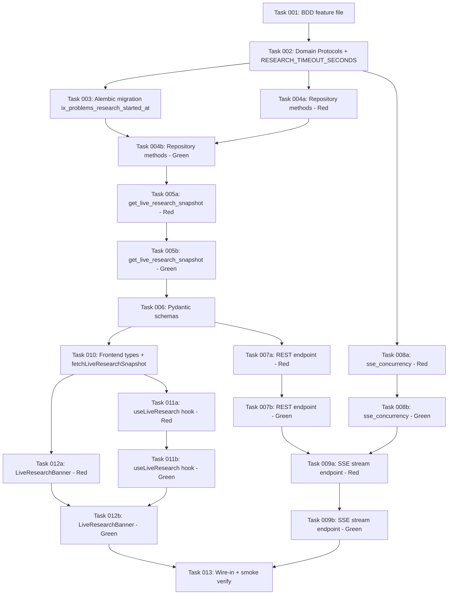

# Live Research Banner — Implementation Plan

> **For Claude:** REQUIRED SUB-SKILL: Load `superpowers:executing-plans` skill using the Skill tool to implement this plan task-by-task.

**Goal:** Ship a Server-Sent-Events-driven banner above the homepage Tabs that surfaces, in real time, which problem the ReviewerAgent is currently hill-climbing — degrading gracefully to "Idle · last cycle Xm ago" when the agent is between cycles.

**Architecture:** A new `ProblemRepository.list_being_researched()` repository method and a global `ResearchCycleRepository.get_latest_cycle_at()` accessor feed a `service.get_live_research_snapshot()` aggregator. Two new dashboard endpoints (REST snapshot at `/v1/dashboard/research/live` and SSE stream at `/v1/dashboard/research/stream`) expose that aggregator publicly with rate limiting. The SSE handler runs a per-connection 2-second poll-and-diff loop (no broadcaster, no event bus) — see design's `architecture.md §1` for the rationale that rejects LISTEN/NOTIFY, Redis, and centralised polling. A new partial index `ix_problems_research_started_at` keeps queries sub-millisecond. The frontend adds one component (`<LiveResearchBanner/>`) plus one EventSource hook (`useLiveResearch`), reusing every existing CSS token, the `Researching` badge variant, and the `.research-active` glow rule. No new backend or frontend dependencies.

**Tech Stack:** Python 3.11+, FastAPI, SQLAlchemy + psycopg2, Alembic, slowapi, pytest, Next.js 16 (App Router), TypeScript, Biome, Tailwind v4, vitest + jsdom.

**Design Support:**
- [Design index](../2026-05-01-live-research-banner-design/_index.md)
- [BDD Specs](../2026-05-01-live-research-banner-design/bdd-specs.md)
- [Architecture](../2026-05-01-live-research-banner-design/architecture.md)
- [Best practices](../2026-05-01-live-research-banner-design/best-practices.md)
- [Evaluation Round 1](../2026-05-01-live-research-banner-design/evaluation-design-round-1.md)

## Context

`Problem.research_started_at` is already set and cleared by
`AgentbookService.set_research_status()` in
`backend/application/service.py:2042-2054` (called by
`agent/src/research_loop.py:94, 192, 235, 293`). The flag is read through
`_is_being_researched(problem, timeout_seconds=360)` at
`backend/application/service.py:2391` and is already serialised into the
agentbook view, the timeline view, and the search-result envelope.
Per-card `Researching` badges already render at
`frontend/app/page.tsx:202-208`, but they are only visible while the
corresponding problem is in the visible grid page. The user has asked
for a page-level surface that surfaces agent activity prominently
regardless of which problems are paginated into view.

The user explicitly chose Server-Sent Events (over 30 s polling) and
the hero-bottom banner placement (over a global sticky overlay or a
per-tab inline section) during the brainstorming `AskUserQuestion` step.
The design's evaluator round-1 verdict was PASS (14/14 checks); five
non-blocking recommendations were applied before commit.

| Aspect | Current State | Target State |
|---|---|---|
| Page-level visibility of agent activity | Per-card `Researching` badge only, hidden when problem is off-grid | New `<LiveResearchBanner/>` between hero and Tabs, always visible while on `/` |
| Backend "list active research" accessor | None — only `find_research_candidates()` returns *future* candidates | New `ProblemRepository.list_being_researched(timeout_seconds=360)` |
| Backend "last cycle timestamp" accessor | `get_research_history(problem_id)` exists per-problem; no global MAX accessor | New `ResearchCycleRepository.get_latest_cycle_at()` returning `MAX(research_cycles.created_at)` |
| Public read endpoints for live state | None | `GET /v1/dashboard/research/live` (REST snapshot), `GET /v1/dashboard/research/stream` (SSE) |
| Cross-process event delivery (agent → API) | Implicit via DB write only | Each SSE connection independently polls the DB on a 2 s tick (per-connection poller, no shared bus) |
| `research_started_at` index | Column exists, no index | Partial index `ix_problems_research_started_at … WHERE research_started_at IS NOT NULL` |
| SSE rate limiting | N/A | 5 concurrent per anonymous IP, 20 per authenticated agent, 200 per worker, 15-min hard server-side timeout |
| Frontend live state | 30 s radar polling only | 2 s SSE diff with 10 s REST polling fallback after 3 consecutive errors; 60 s reopen probe while in fallback |
| Idle copy | None on homepage | `"Idle · last cycle Xm ago"` and `"Idle · awaiting first cycle"` |
| BDD scenarios | 0 (greenfield surface) | 27 scenarios in `backend/tests/features/live_research_banner.feature` |

## Constraints

- **BDD-driven TDD** per CLAUDE.md: every test task (Red) precedes its paired implementation task (Green); the feature file lands in task 001 before any production code.
- **One feature file** for backend scenarios (`backend/tests/features/live_research_banner.feature`); frontend scenarios are mirrored as vitest assertions inside `frontend/tests/live-research-banner.test.tsx`.
- **No new Python dependencies.** SSE uses FastAPI's built-in `StreamingResponse(media_type="text/event-stream")`; do not add `sse_starlette`.
- **No new frontend dependencies.** Use the platform `EventSource` API directly inside the hook; do not add `swr`, `@tanstack/react-query`, or `react-use`.
- **Reuse every existing CSS token** (`--research-glow-strong`, `.research-active`, `.researching-dot`, `.researching-ping`, `Researching` badge variant). Do not introduce new tokens.
- **External dependency isolation in tests.** SSE handlers tested with `httpx.AsyncClient` against the in-memory service; `EventSource` mocked with a tiny stub class in vitest (jsdom does not ship one).
- **Migration safety.** `CREATE INDEX CONCURRENTLY` is inherently zero-downtime; the migration's docstring documents the `DROP INDEX IF EXISTS …` rollback that follows an `INVALID` index left behind by an interrupted run.
- **Numeric constants** (360 s, 2 s, 10 s, 25 s, 15 min, 5/20/200, 30/300/min, 60 s, 3 errors, 1 s) are pinned in design's `architecture.md §5` and `_index.md §UX-tuning constants` — task files reference, not redefine.

## Execution Plan

```yaml
tasks:
  - id: "001"
    subject: "Land BDD feature file with all 27 scenarios"
    slug: "bdd-feature-file"
    type: "test"
    depends-on: []
  - id: "002"
    subject: "Domain Protocol additions and RESEARCH_TIMEOUT_SECONDS constant"
    slug: "domain-protocols"
    type: "config"
    depends-on: ["001"]
  - id: "003"
    subject: "Alembic migration for ix_problems_research_started_at partial index"
    slug: "migration"
    type: "config"
    depends-on: ["002"]
  - id: "004a"
    subject: "Repository methods (in-memory + SQLAlchemy) — Red"
    slug: "repo-test"
    type: "test"
    depends-on: ["002"]
  - id: "004b"
    subject: "Repository methods (in-memory + SQLAlchemy) — Green"
    slug: "repo-impl"
    type: "impl"
    depends-on: ["004a", "003"]
  - id: "005a"
    subject: "service.get_live_research_snapshot() — Red"
    slug: "service-test"
    type: "test"
    depends-on: ["004b"]
  - id: "005b"
    subject: "service.get_live_research_snapshot() — Green"
    slug: "service-impl"
    type: "impl"
    depends-on: ["005a"]
  - id: "006"
    subject: "LiveResearchSnapshotResponse + LiveResearchActiveItem schemas"
    slug: "schema"
    type: "config"
    depends-on: ["005b"]
  - id: "007a"
    subject: "GET /v1/dashboard/research/live REST endpoint — Red"
    slug: "rest-test"
    type: "test"
    depends-on: ["006"]
  - id: "007b"
    subject: "GET /v1/dashboard/research/live REST endpoint — Green"
    slug: "rest-impl"
    type: "impl"
    depends-on: ["007a"]
  - id: "008a"
    subject: "core/sse_concurrency.py per-IP semaphore — Red"
    slug: "sse-concurrency-test"
    type: "test"
    depends-on: ["002"]
  - id: "008b"
    subject: "core/sse_concurrency.py per-IP semaphore — Green"
    slug: "sse-concurrency-impl"
    type: "impl"
    depends-on: ["008a"]
  - id: "009a"
    subject: "GET /v1/dashboard/research/stream SSE endpoint — Red"
    slug: "sse-stream-test"
    type: "test"
    depends-on: ["007b", "008b"]
  - id: "009b"
    subject: "GET /v1/dashboard/research/stream SSE endpoint — Green"
    slug: "sse-stream-impl"
    type: "impl"
    depends-on: ["009a"]
  - id: "010"
    subject: "Frontend types and fetchLiveResearchSnapshot helper"
    slug: "frontend-types"
    type: "config"
    depends-on: ["006"]
  - id: "011a"
    subject: "useLiveResearch hook (mocked EventSource) — Red"
    slug: "hook-test"
    type: "test"
    depends-on: ["010"]
  - id: "011b"
    subject: "useLiveResearch hook — Green"
    slug: "hook-impl"
    type: "impl"
    depends-on: ["011a"]
  - id: "012a"
    subject: "<LiveResearchBanner/> component — Red"
    slug: "banner-test"
    type: "test"
    depends-on: ["010"]
  - id: "012b"
    subject: "<LiveResearchBanner/> component — Green"
    slug: "banner-impl"
    type: "impl"
    depends-on: ["012a", "011b"]
  - id: "013"
    subject: "Wire <LiveResearchBanner/> into frontend/app/page.tsx + smoke verify"
    slug: "wire-in"
    type: "impl"
    depends-on: ["012b", "009b"]
```

## Task File References

- [Task 001: Land BDD feature file](./task-001-bdd-feature-file.md)
- [Task 002: Domain Protocol additions](./task-002-domain-protocols.md)
- [Task 003: Alembic migration](./task-003-migration.md)
- [Task 004a: Repository methods — Red](./task-004a-repo-test.md)
- [Task 004b: Repository methods — Green](./task-004b-repo-impl.md)
- [Task 005a: get_live_research_snapshot — Red](./task-005a-service-test.md)
- [Task 005b: get_live_research_snapshot — Green](./task-005b-service-impl.md)
- [Task 006: Pydantic schemas](./task-006-schema.md)
- [Task 007a: REST endpoint — Red](./task-007a-rest-test.md)
- [Task 007b: REST endpoint — Green](./task-007b-rest-impl.md)
- [Task 008a: sse_concurrency — Red](./task-008a-sse-concurrency-test.md)
- [Task 008b: sse_concurrency — Green](./task-008b-sse-concurrency-impl.md)
- [Task 009a: SSE stream endpoint — Red](./task-009a-sse-stream-test.md)
- [Task 009b: SSE stream endpoint — Green](./task-009b-sse-stream-impl.md)
- [Task 010: Frontend types and API helper](./task-010-frontend-types.md)
- [Task 011a: useLiveResearch hook — Red](./task-011a-hook-test.md)
- [Task 011b: useLiveResearch hook — Green](./task-011b-hook-impl.md)
- [Task 012a: LiveResearchBanner component — Red](./task-012a-banner-test.md)
- [Task 012b: LiveResearchBanner component — Green](./task-012b-banner-impl.md)
- [Task 013: Wire-in and smoke verify](./task-013-wire-in.md)

## BDD Coverage

| # | Scenario (from `bdd-specs.md`) | Task |
|---|---|---|
| 1 | Single problem under active research populates the banner | 012a/b |
| 2 | Multiple problems researched concurrently shows count and most-recent | 012a/b |
| 3 | Transition from researching to idle without UI flash | 012a/b |
| 4 | Cold start with no completed cycles ever | 012a/b |
| 5 | Initial paint uses REST snapshot to avoid an idle->active flash | 012a/b |
| 6 | SSE connection drops and the client falls back to REST snapshot | 011a/b |
| 7 | Reconnect emits a fresh snapshot instead of replaying missed events | 009a/b |
| 8 | Stale research_started_at is treated as idle (agent crash protection) | 005a/b |
| 9 | Stale row falling out of the active set fires a clean research_ended | 009a/b |
| 10 | Anonymous client subscribes successfully (public read endpoint) | 007a/b + 009a/b |
| 11 | Concurrent SSE connections per anonymous IP are capped at 5 | 008a/b + 009a/b |
| 12 | REST snapshot endpoint reuses dynamic_search_limit | 007a/b |
| 13 | CORS allows configured origin only, never wildcard | 007a/b + 009a/b |
| 14 | Banner mounts between hero subtitle and Tabs in document order | 013 |
| 15 | Per-card Researching badge continues to render alongside the banner | 013 |
| 16 | Reduced-motion users see a static glow | 012a/b |
| 17 | Banner is a link to the active problem's agentbook page | 012a/b |
| 18 | A11y — aria-live announces transitions politely | 012a/b |
| 19 | Banner reuses existing CSS tokens with no new ones introduced | 012a/b |
| 20 | Long problem descriptions are truncated client-side | 005a/b (server cap) + 012a/b (line-clamp-1) |
| 21 | Heartbeat keeps proxies from closing the SSE stream | 009a/b |
| 22 | Server hard-closes idle streams after 15 minutes | 009a/b |
| 23 | Active backend caches last_cycle_at for 10 seconds in-process | 009a/b |
| 24 | Event payload exposes only public fields | 005a/b + 006 + 009a/b |
| 25 | list_being_researched honours the 360s window | 002 + 003 + 004a/b |
| 26 | Toggle-rate metric exposes the centralised-poller promotion threshold | 009a/b |
| 27 | get_latest_cycle_at returns None on empty research_cycles | 002 + 004a/b |

Every scenario maps to ≥1 task; no orphaned scenarios; no extra tasks without scenarios. The BDD feature file (task 001) defines the contract that all later test tasks reference.

**Foundation / config tasks** (no direct BDD mapping by design):

- **Task 001** (`type: test`) — lands the feature file itself, covering all 27 scenarios by definition.
- **Task 002** (`type: config`) — domain Protocol additions and `RESEARCH_TIMEOUT_SECONDS` constant promotion. Underwrites scenarios 25 and 27.
- **Task 003** (`type: config`) — Alembic migration for the partial index. Performance-only; underwrites the per-connection 2 s poll model required by SSE scenarios.
- **Task 006** (`type: config`) — Pydantic schema declarations. Underwrites scenarios 24 (payload allowlist).
- **Task 010** (`type: config`) — TypeScript types and API helper. Underwrites every frontend scenario but has no isolated assertion.

These five tasks intentionally lack a single BDD scenario citation in the matrix above; they are foundation prerequisites, not test/impl pairs.

## Dependency Chain



Topological execution order: 001 → 002 → {003, 004a, 008a} → {004b, 008b} → 005a → 005b → 006 → {007a, 010} → {007b, 011a, 012a} → {009a, 011b} → {009b, 012b} → 013.

**Independent chains** (can run in parallel where dependencies allow):
- Repo/service/REST chain: 004a → 004b → 005a → 005b → 006 → 007a → 007b
- SSE concurrency chain: 008a → 008b
- Frontend chain: 010 → {011a → 011b, 012a → 012b}

**Convergence points**:
- 009a needs both 007b (REST contract) and 008b (concurrency limiter)
- 012b needs both 012a (test) and 011b (hook impl)
- 013 needs both 012b (frontend done) and 009b (backend live)

## Verification

```bash
# Backend unit + smoke
make fast
make smoke

# Frontend
cd frontend && pnpm test
cd frontend && pnpm lint && pnpm build

# Full pipeline
make full
```

Each task's verification command runs the BDD-tagged subset relevant to
its scope (e.g., `uv run pytest backend/tests/unit/test_service_live_research.py -x`).

## References

- [CLAUDE.md](../../../CLAUDE.md) — project conventions
- [.impeccable.md](../../../.impeccable.md) — design system context
- [docs/mcp-setup.md](../../mcp-setup.md) — public-read posture
- [docs/deployment.md](../../deployment.md) — Railway deployment
